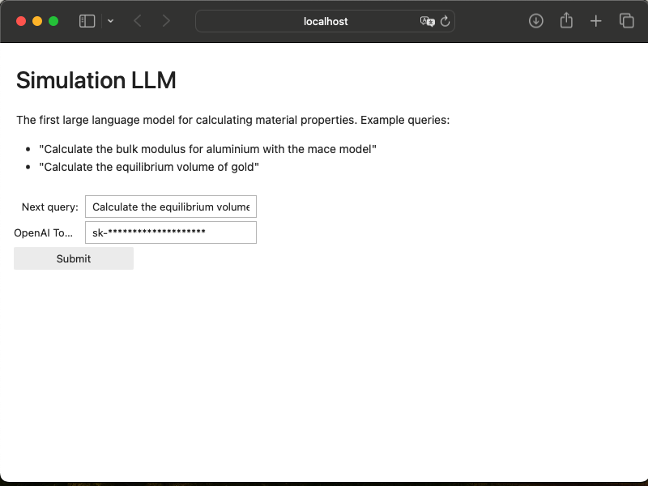

# Run Calculations with a Large Language Model
[](https://mybinder.org/v2/gh/jan-janssen/LangSim/HEAD?labpath=9_experimental_reference.ipynb)
[](https://mybinder.org/v2/gh/jan-janssen/LangSim/main?urlpath=/voila/render/7_voila.ipynb)
[](https://hub.docker.com/r/ltalirz/LangSim)

The computational chemistry and computational materials science community have both developed a great number of 
simulation tools. Still these tools typically require either rather cryptic input files or at least a fundamental 
programming experience in a language like Python to control them. Furthermore, many questions are only answered in the 
documentation, like: 
* Which physical units does the code use? 
* Which inputs match to which variables in the equations in the paper? 
* ...

We address this challenge by developing a Large Language Model (LLM) extension which provides LLM agents to couple the 
LLM to scientific simulation codes and calculate physical properties from a natural language interface.

## Installation 
### Via pip 
While our package is not yet available on the Python Package Index, you can install it directly using:
```
pip install git+https://github.com/jan-janssen/LangSim.git
```
The pip package includes optional dependencies for the `mace` model and the `jupyter` integration.  

### Via conda 
As the conda package is not yet available on Anaconda.org still you can clone the repository and install the 
dependencies directly from conda using the [environment.yml](environment.yml) file. 

Prerequisites:
- [git](https://git-scm.com/)
- [conda](https://docs.conda.io/en/latest/miniconda.html)

 ```bash
git clone https://github.com/jan-janssen/LangSim
cd LangSim
conda env create -f environment.yml --name LangSim
```

### Via Docker Container
We build a docker container on every commit to the `main` branch.
You can pull the container from the [Docker Hub](https://hub.docker.com/r/ltalirz/langsim) using:
```bash
docker run -p 8866:8866 ltalirz/langsim
```

## Using the package
The package currently provides two interfaces, one for python / jupyter users to query the large language model directly
from a python environment and a second web based interface. 

### Python Interface
```python
import os
from llm_compmat import dialog_python

dialog_python(OPENAI_API_KEY=os.getenv("OPENAI_API_KEY", None))
```
Here the `OPENAI_API_KEY` environment variable referrers to your [OpenAI API token](https://help.openai.com/en/articles/4936850-where-do-i-find-my-openai-api-key).

### Webbased interface
The webbased interface can be started using [voila](https://voila.readthedocs.io):
```
voila 7_voila.ipynb
```
This opens a small application in the webbrowser:


## Contributors
* [Yuan Chiang](https://github.com/chiang-yuan)
* [Giuseppe Fisicaro](https://github.com/giuseppefisicaro)
* [Jan Janssen](https://github.com/jan-janssen)
* [Greg Juhasz](https://github.com/gjuhasz)
* [Sarom Leang](https://github.com/saromleang)
* [Bernadette Mohr](https://github.com/Bernadette-Mohr)
* [Utkarsh Pratiush](https://github.com/utkarshp1161)
* [Francesco Ricci](https://github.com/fraricci)
* [Leopold Talirz](https://github.com/ltalirz)
* [Pablo Andres Unzueta](https://github.com/pablo-unzueta)
* [Trung Vo](https://github.com/btrungvo)
* [Gabriel Vogel](https://github.com/GaVogel)
* [Luke Zondagh](https://github.com/Luke-Zondagh)
